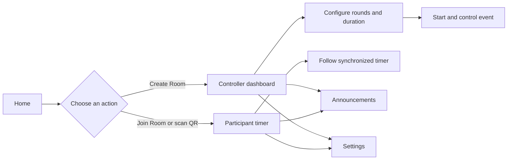
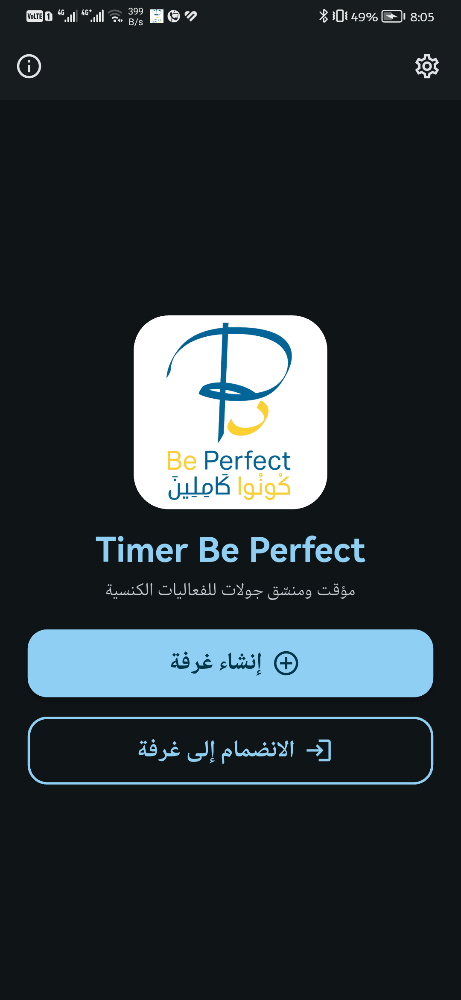
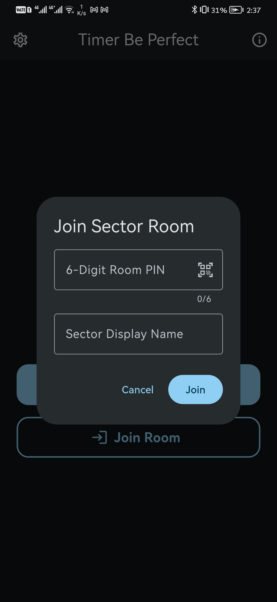
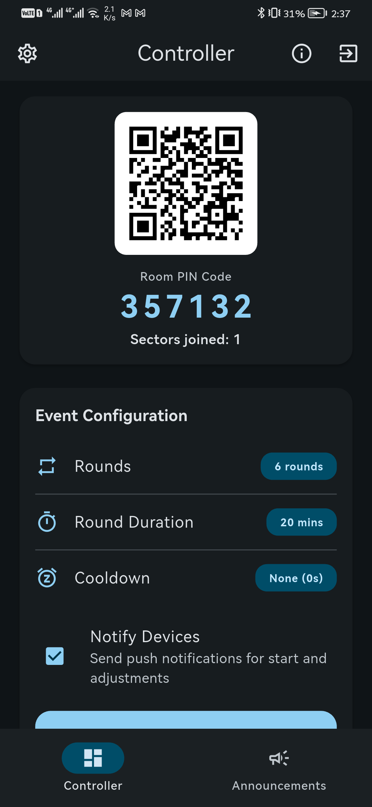
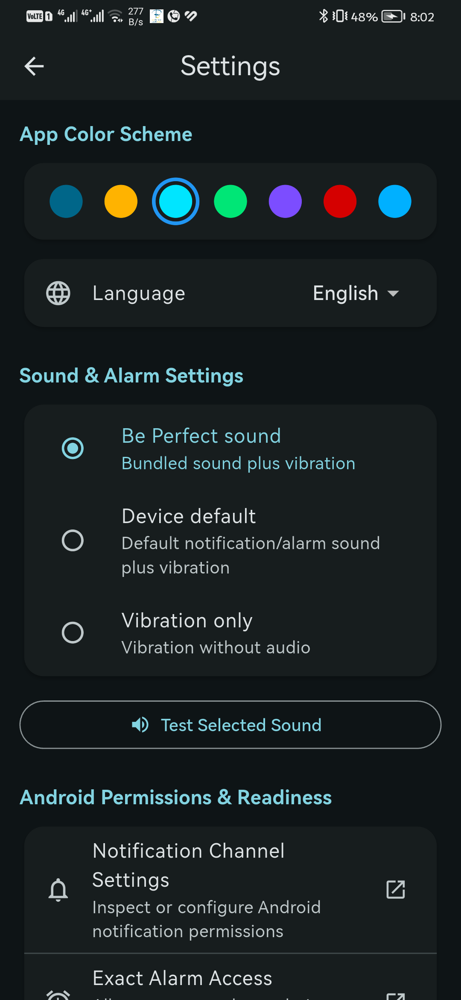
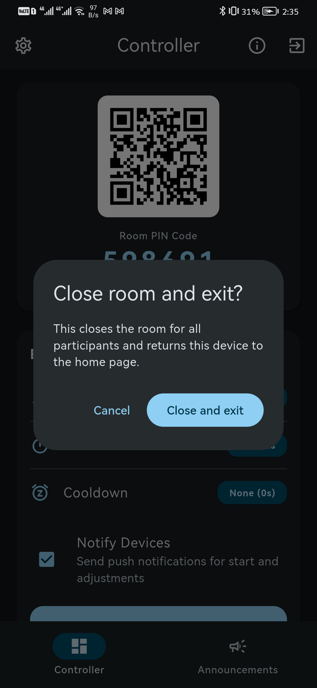

# Timer Be Perfect

<p align="center">
  
</p>

<p align="center">
  A synchronized church-event timer for controllers and participant devices.
</p>

The installed Android application name is **Timer Be Perfect**. The underlying
project and event may still be referred to as **Be Perfect**.

User-facing copy should stay simple and role-neutral:

- **Create Room** instead of “Create Room (G-man)”.
- **Join Room** instead of “Join Room (Sector)”.
- **Controller** when a role must be named.
- **Participant** when a joined device must be named.

Internal source identifiers and Firebase fields may retain their current names
until a deliberate schema refactor is justified. They must not leak into normal
user-facing labels.

Be Perfect is an Android event-coordination application for church student activities. It synchronizes timed rounds across sector phones, gives each event leader live control, and continues operating from the last confirmed schedule when internet access is interrupted.

The project is developed by **CyberBonk**.

For a 60-second technical review, start with the [architecture and verification
snapshot](docs/architecture.md), then review the [release history](docs/releases/RELEASE_HISTORY.md).
Historical prompts and handoffs are retained under [`docs/internal/`](docs/internal/)
as public development context, separate from the running app.

## Project Status

Version **2.2.0** is implemented in Flutter and backed by Firebase. It adds
English/Arabic localization, a device-language default, participant messaging,
synchronized server-clock timers, offline warnings, and persistent dismissible
round alarms. Core room control works on the Firebase base plan through the
secured Firestore fallback path; Cloud Functions are an optional Blaze-plan
enhancement for server-side processing and push delivery.

The original implementation handoff prompt is retained as a historical artifact
in [`docs/internal/prompts/GEMINI_IMPLEMENTATION_PROMPT.md`](docs/internal/prompts/GEMINI_IMPLEMENTATION_PROMPT.md).

To run the project with your own Firebase backend, replace the generated
client-side Firebase configuration with your own project configuration and
deploy your own rules/functions. No service-account credentials or signing
secrets are required from this repository.

### Branding customization

Replace [`assets/branding/logo-transparent.png`](assets/branding/logo-transparent.png)
with one transparent image for the in-app home logo and the project’s visual
identity. If the launcher icon is also being customized, regenerate the Android
`mipmap-*` launcher assets from that same source image rather than committing a
second competing logo.

### Engineering checks

Every push and pull request runs `flutter analyze` and `flutter test` through
[GitHub Actions](.github/workflows/flutter.yml). Release APKs and the App Bundle
belong in GitHub Release assets; the source tree keeps the release notes,
checksums, symbols policy, and build commands.

## Core Idea

Be Perfect uses a room model:

1. Any installed device can choose **Create room**.
2. That device becomes the **G-man** for the room it created.
3. The app generates a six-digit PIN and a QR code.
4. Sector devices join that room by scanning the QR code or entering the PIN.
5. The G-man configures and controls the event for the devices in that room.

There is no developer-assigned list of masters and no special master build. The developer owns and maintains the Firebase project, but any normal app installation may create a room.

Multiple G-men and rooms may exist simultaneously. Each room is independent and has its own members, timer, announcements, and event state. In version 1, each room has one owning G-man. Joining a room never grants G-man privileges.

## Roles

### G-man

The G-man is the device that creates a room. It can:

- Accept any number of participant sectors.
- Configure the number of rounds.
- Configure the standard round duration.
- Configure an optional cooldown between rounds.
- See which sectors joined.
- See sector readiness and online status.
- Start, pause, resume, or end an event.
- Adjust the active round using `-5`, `-1`, `+1`, and `+5` minute controls.
- End the current round early.
- Send text announcements.
- Remove or rename joined sectors.
- Start another event without forcing everyone to leave the room.
- Close the room.

G-man authority belongs only to the room created by that device. The creator does not control other G-men or their rooms.

### Sector

A sector device:

- Joins a particular room through its QR code or six-digit PIN.
- Enters a unique custom sector name.
- Sees the synchronized timer and round progress.
- Sees the current timer in an ongoing Android notification, including on the lock screen where device settings permit it.
- Receives round alarms and G-man announcements.
- May send a message to the shared announcement feed.
- Sees a warning when its state may be stale because it is offline.
- Cannot modify the schedule.
- Remains in the room after an event finishes until it leaves or the G-man closes the room.

## Default Event Configuration

| Setting | Default |
| --- | ---: |
| Sector capacity | Unlimited |
| Rounds | 6 |
| Round duration | 20 minutes |
| Cooldown | 0 seconds |

Rooms accept any number of participant sectors. The legacy `sectorCapacity` field remains readable for older room documents, but it is no longer enforced.

## Event Lifecycle

The main states are:

```text
Lobby -> Starting -> Running -> Paused -> Running -> Completed
```

`Closed` is a separate terminal state for the room itself.

### Starting and resuming

- The server creates an authoritative future start timestamp.
- Devices display a synchronized `3-2-1` during the final three seconds.
- The synchronized countdown occurs on the initial start and after a resume.
- A device that receives the update late jumps to the correct position rather than starting its own independent countdown.

### Normal round transition

When a non-final round reaches zero:

1. Every prepared sector phone raises its locally scheduled alarm.
2. The UI marks the round as complete.
3. The configured cooldown runs.
4. The next full-duration round starts automatically.

If cooldown is zero, the next round starts immediately. Normal automatic transitions do not use a separate start overlay.

### Final round

When the last round ends:

- The final alarm rings.
- The event becomes **Completed**.
- Devices stay inside the room.
- The G-man may configure and start another event.

When starting another event, the G-man chooses whether to keep the previous notification history with event dividers or show a fresh feed for the new event.

### Active-round adjustments

The G-man can adjust only the currently active round:

- `-5 minutes`
- `-1 minute`
- `+1 minute`
- `+5 minutes`

The configured standard duration of future rounds does not change. An adjustment shifts the absolute times of later phases, but their individual durations remain unchanged. Subtracting to zero ends the current round normally.

## Application Interface

The app uses Material 3, also known as Material You.

### Visual walkthrough

The main interaction is intentionally short: create or join a room, then use the
role-specific timer surface. The same room keeps the controller and participant
devices synchronized while announcements remain available from the bottom bar.



<p align="center">
  
  
  
  
</p>

The captures above show the current device-tested flow. The controller dashboard
shares the room through a QR code or six-digit PIN; participants then receive the
same event state and announcements without gaining controller privileges.

<details>
<summary>Destructive room action</summary>

Closing a room clearly explains that all participants will be disconnected before
requiring confirmation.

<p align="center">
  
</p>
</details>

### Sector navigation

- **Timer**
- **Announcements**

### G-man navigation

- **Dashboard**
- **Announcements**
- **Settings**

The bottom component is a Material 3 `NavigationBar`. A `NavigationRail` may be used only if a future large-screen layout needs it.

### Timer screen

The sector timer screen contains:

- Round progress at the top, such as `2 / 6`.
- A large timer in the center.
- Current state: starting, running, paused, cooldown, completed, or offline.
- A persistent offline warning when the latest server state cannot be confirmed.
- A shortcut to the announcement feed.

Round progress uses the configured round count, not the sector count.

### G-man dashboard

The dashboard contains:

- Room PIN and QR code.
- Event configuration.
- Timer and control buttons.
- Joined-sector roster.
- Online/offline and last-seen state.
- Notification and exact-alarm readiness.
- A warning before starting if sector phones are not ready.

### About page

The Settings destination includes an **About** page containing:

> Developed for Be Perfect by [CyberBonk](https://github.com/CyberBonk)

The developer name opens the CyberBonk GitHub profile using the device's external browser. The page should also show the application name, installed version, and build number using the active Material 3 theme.

## Announcements and Notifications

The announcement feed is shared:

- The G-man may send text messages.
- Participant devices may send text messages identified by participant name.
- Important control changes create system entries.
- The G-man sees the same feed as the sectors.

The **Notify devices** option is selected by default for G-man messages and state changes. Turning it off suppresses the push notification but does not suppress synchronization or the feed entry.

Round-completion alarms are core timer behavior and are not disabled by this option.

Firebase Cloud Messaging is an alert and wake-up mechanism, not the authoritative timer. A notification includes a room ID, event ID, run ID, and schedule revision. When received, the client loads the newest permitted room state.

## Ongoing Timer Notification

Every G-man and joined sector device displays one ongoing Android notification while an event is starting, running, paused, or in cooldown. The user does not need to keep the Flutter interface open.

The notification contains:

- App and room identity.
- Current status.
- Current round and total rounds.
- A system-rendered countdown to the end of the active round.
- A system-rendered countdown to the next round during cooldown.
- Static remaining time while paused.
- A tap action that opens the correct room and screen.

Use Android's native notification chronometer through `flutter_local_notifications`. Configure the shared timer notification with behavior equivalent to:

```dart
AndroidNotificationDetails(
  timerChannelId,
  'Active event timer',
  ongoing: true,
  autoCancel: false,
  onlyAlertOnce: true,
  visibility: NotificationVisibility.public,
  usesChronometer: true,
  chronometerCountDown: true,
  when: phaseEndTimestampMilliseconds,
)
```

The operating system renders the chronometer. Flutter must not wake once per second to rewrite the notification.

Use one stable notification ID per active room membership. Schedule exact local operations that update this same notification ID at every round or cooldown boundary. A schedule revision cancels obsolete boundary operations and schedules the replacement set.

Notification behavior by state:

| State | Notification |
| --- | --- |
| Starting or resuming | Synchronized countdown to the authoritative start time |
| Running | Countdown to the current round end, with `Round X of N` |
| Cooldown | Countdown to the next round start |
| Paused | Static paused state and remaining duration |
| Completed | Replace the ongoing timer with a normal completion notification |
| Room closed or user leaves | Cancel the room's timer notification and pending alarms |

The notification is designed to survive the Flutter UI being closed, swiped away, or reclaimed by Android. Exact scheduled boundaries and FCM state updates keep it current without a continuously executing Dart timer.

Platform limitations must be communicated honestly:

- Android 13 and newer require notification permission.
- The lock-screen presentation depends on the user's notification privacy settings.
- Users and some Android versions or manufacturers may dismiss or suppress notifications.
- Force-stopping the app in Android Settings disables its alarms and messages until the app is opened again.
- Reboot restoration must recreate the notification and remaining alarms from persisted schedule data.

The app should not add a permanent foreground service unless real-device testing proves that the system chronometer plus scheduled notification updates cannot satisfy the event requirements. If a foreground service becomes necessary later, it must be treated as a separate Android-version and battery-policy decision.

## Be Perfect Round Sound

Round and final-event alarms use a bundled **Be Perfect sound** by default so every event phone produces a consistent audible signal instead of a different manufacturer ringtone.

The final user-provided audio file should be stored as an Android raw resource with a stable lowercase name, for example:

```text
android/app/src/main/res/raw/be_perfect_round_alarm.wav
```

The extension may use a supported Android audio format, but Flutter references the resource without its extension:

```dart
sound: const RawResourceAndroidNotificationSound(
  'be_perfect_round_alarm',
),
audioAttributesUsage: AudioAttributesUsage.alarm,
```

The application must not download the essential alarm sound at runtime. Bundling it inside every ABI APK ensures that it remains available offline and is identical across devices.

The ongoing timer notification remains silent. The bundled sound plays only for:

- Normal round completion.
- A round ended early by the G-man.
- Final event completion.
- The sound-test action in Settings.

Pause, resume, time adjustments, cooldown starts, and routine ongoing-notification refreshes must not replay the alarm sound.

### Sound settings

Settings provides:

- **Be Perfect sound** — bundled sound and vibration; selected by default.
- **Device default** — the phone's normal notification/alarm sound.
- **Vibration only** — no audible ringtone.
- **Test sound** — immediately previews the currently selected behavior.
- **Open Android notification settings** — lets the user inspect or restore the channel's sound and importance.

Android 8 and newer associate sound and vibration with notification channels and do not allow the app to change those behaviors after a channel is created. Implement the choices using separate stable channels:

| Channel | Purpose |
| --- | --- |
| `be_perfect_active_timer_v2` | Silent ongoing countdown |
| `be_perfect_round_custom_v3` | Bundled Be Perfect sound and vibration |
| `be_perfect_round_system_v3` | Device-default sound and vibration |
| `be_perfect_round_vibration_v3` | Vibration only |
| `be_perfect_announcements_v2` | Announcement notifications |

Changing the application setting selects the appropriate channel for newly scheduled round alarms. It must cancel and reschedule remaining alarms so the new choice takes effect.

The user retains final control through Android's channel settings, volume, silent mode, and Do Not Disturb. The readiness screen should detect whether the selected channel is disabled or has insufficient importance and provide a direct link to its Android settings rather than claiming the app can override the user.

The custom sound asset is currently **pending delivery by CyberBonk**. Implementation may use a clearly marked temporary sound during development, but the release candidate must use the supplied final file and verify it on the real event phones.

## Synchronization Model

The application must not send network requests every second.

Instead:

1. Firebase stores an authoritative schedule using server timestamps.
2. Each client listens to the small state document for its joined room.
3. Each client calculates the visible countdown locally.
4. Each client schedules the remaining Android round alarms locally.
5. A new revision causes clients to cancel obsolete alarms and schedule the new boundaries.

This design minimizes battery use, Firestore reads, and Firebase cost.

### Schedule revisions

Every accepted G-man command increments the room schedule revision. Clients:

- Ignore older revisions.
- Deduplicate repeated event IDs.
- Recompute the current phase after resuming from the background.
- Recreate local alarms when the schedule changes.

## Offline Behavior

All devices are expected to have internet access, but temporary loss must not destroy the active event.

### Sector offline

- Continue the last confirmed schedule locally.
- Continue round and cooldown transitions.
- Raise already scheduled local alarms.
- Show that recent G-man changes may be missing.
- Reconcile to the newest schedule revision when Firebase reconnects.

An offline sector cannot receive a change that has not reached it. The G-man dashboard therefore shows which sectors are offline before a schedule change is made.

### G-man offline

- The confirmed schedule continues locally.
- Shared controls are disabled.
- The app does not queue commands that might unexpectedly affect all devices later.
- Controls are restored after reconnection and state reconciliation.

## Firebase Architecture

### Services

- **Firebase Anonymous Authentication:** identifies installations without a login screen.
- **Cloud Firestore:** rooms, memberships, event runs, schedules, and feed entries.
- **Realtime Database:** efficient connection presence through `.info/connected` and `onDisconnect`.
- **Firebase Cloud Messaging:** background announcements and update notifications.
- **Cloud Functions v2:** trusted room creation, joining, commands, validation, and message delivery.

The Firebase project uses the Blaze plan because deployed Cloud Functions require it. The system should remain conservative through low function limits, no polling, bounded queries, and billing alerts. A billing alert is not a hard spending cap.

### Suggested data layout

```text
roomCodes/{sixDigitCode}
rooms/{roomId}
rooms/{roomId}/members/{uid}
rooms/{roomId}/runs/{runId}
rooms/{roomId}/feed/{eventId}
```

`roomCodes` is a server-only mapping from the short invitation code to an opaque room ID. Knowing a valid PIN allows a device to request membership, but it does not grant direct database access or G-man authority.

Realtime Database stores only the minimal mirrored membership metadata and active connection nodes required for presence rules.

### Trusted operations

Cloud Functions should expose operations equivalent to:

```text
createRoom
joinRoom
startRun
applyRoomCommand
sendAnnouncement
updateMember
leaveRoom
removeMember
refreshMessagingToken
closeRoom
```

Every mutation includes:

- Firebase authenticated UID.
- Room ID where applicable.
- Unique client command ID.
- Expected schedule revision.

Server transactions enforce ownership, unique sector names, valid state transitions, and idempotency. Participant sectors are not capped.

### Multi-room behavior

- Room creation is available to every authenticated installation.
- One UID may own its created rooms.
- Each client listens only to its currently joined room.
- Commands always include and validate the target room ID.
- FCM tokens are associated with memberships, not a global event topic.
- Announcements and presence never leak between rooms.
- Simultaneous rooms do not share schedules or sector lists.

## Android Notifications and Alarms

The app is distributed privately as ABI-split APK files. Version 2.2.0 also
produces a Play-Store-ready App Bundle, although this milestone does not
include publishing it.

**Android 10 / API level 29 is the primary quality baseline, not a hard minimum.**

The intended compatibility floor is **Android 8.0 Oreo / API level 26**:

```kotlin
minSdk = 26
```

API 26 should be retained only if the complete Firebase, QR, timer, ongoing-notification, exact-alarm, reboot-restoration, and ABI-split release matrix passes without weakening behavior on Android 10 and newer. If a required dependency or platform workaround makes Oreo support unreliable or materially complicates the core timer, the release may raise `minSdk` to 29 rather than ship a lower-quality compatibility path.

The project should compile and target the current Android SDK required by its Flutter toolchain. `minSdk` controls the oldest supported device; it does not disable the notification, exact-alarm, or background-execution rules applied when the app runs on newer Android releases.

Modern Android versions require:

- Notification permission.
- User-granted **Alarms & reminders** access for exact alarms.

Android 8 introduces notification channels, so timer, round-alarm, and announcement channels must be created and tested there. Runtime notification permission and special exact-alarm access apply only on the newer Android versions that introduced those requirements.

The app should use `SCHEDULE_EXACT_ALARM` and verify permission before starting an event. It should also restore scheduled alarms after a device reboot.

A readiness flow must test:

- Firebase connectivity.
- Notification permission.
- Exact-alarm access.
- A visible and audible test notification.
- Current room membership.

## Material 3 Theming

Widgets must use semantic theme values, for example:

```dart
Theme.of(context).colorScheme.primary
Theme.of(context).colorScheme.surface
Theme.of(context).colorScheme.errorContainer
```

Literal widget colors should not be scattered through the UI.

Version 2 provides seven centrally generated seed-color themes in one compact
Settings row. Light and dark appearances derive from the selected scheme.

## Testing Requirements

### Unit tests

- Schedule and phase generation.
- Initial synchronized start.
- Pause and resume.
- Cooldown behavior.
- Positive and negative active-round adjustments.
- Final completion.
- Joining midway through a run.
- Clock-offset and lifecycle recomputation.
- Schedule revision ordering.

### Firebase Emulator tests

- Any device can create its own room.
- Separate G-men cannot control each other's rooms.
- A join PIN never grants G-man privileges.
- Outsiders cannot read room data.
- Members cannot modify schedules.
- Simultaneous joins can add any number of uniquely named participant sectors.
- Sector-name uniqueness survives racing joins.
- Duplicate command IDs are idempotent.
- Stale revisions are rejected.
- Notifications and feed events do not cross rooms.

### Multi-device tests

Use at least one G-man and six sector clients, then also run two independent rooms simultaneously.

Test:

- QR and PIN joining.
- Ongoing timer visibility in the notification shade and on the lock screen.
- System chronometer accuracy without one-second Dart or network updates.
- Round and cooldown notification transitions while the Flutter UI is closed.
- Bundled Be Perfect sound consistency across different phone manufacturers.
- Switching between bundled, system-default, and vibration-only alarm channels.
- Rescheduling pending alarms after the sound setting changes.
- Verifying that silent timer updates never replay the round sound.
- Background and terminated clients.
- Process restart and device reboot.
- Client network loss and reconnection.
- G-man network loss.
- Delayed or duplicated FCM messages.
- Missing or revoked permissions.
- Pause during a round and cooldown.
- Adjustment that reaches zero.
- Completing and restarting an event in the same room.
- Closing one room without affecting another.

Run the notification and lifecycle matrix on Android 8, Android 10, Android 12, Android 13, Android 14, and the newest Android version available to the project. Include notification denial where applicable, exact-alarm denial where applicable, battery restriction, swipe-away, process reclamation, reboot, and force-stop recovery behavior.

### Acceptance targets

- No per-second network writes.
- No per-second background Dart notification updates.
- The ongoing notification shows the same round and remaining time as the application within one displayed second.
- The ongoing notification advances at round and cooldown boundaries without opening the application.
- Every prepared phone using the default setting plays the same bundled sound at a round boundary.
- Online clients show a normal state change within two seconds on a healthy test network.
- Online timer displays differ by no more than one displayed second after synchronization.
- Offline clients complete the last confirmed schedule.
- Reconnection does not create duplicate alarms or notifications.
- A complete event rehearsal succeeds on the actual phones.

## Build and Distribution

Build release artifacts with Dart obfuscation and external symbol files:

```powershell
flutter build apk --release --split-per-abi `
  --obfuscate --split-debug-info=build/symbols
flutter build appbundle --release `
  --obfuscate --split-debug-info=build/symbols
```

Keep `build/symbols` with the release records so obfuscated production
stack traces can be symbolized later.

The `arm64-v8a` APK is expected to cover normal modern Android phones. Retain the other generated ABI variants for compatible older or test hardware.

This milestone does not include Google Play publication.

## Implementation Pipeline

1. Scaffold Flutter, Firebase environments, Material 3, anonymous authentication, and emulator support.
2. Implement multi-room creation, PIN/QR joining, sector membership, and presence.
3. Implement the timestamped timer engine, cooldowns, offline cache, and local alarms.
4. Implement G-man commands and revision handling.
5. Implement the one-way feed and FCM delivery.
6. Add Firebase Security Rules and emulator tests.
7. Run lifecycle, failure, and multi-room testing.
8. Generate signed ABI-split APKs.
9. Rehearse a complete event on the intended phones.
10. Add the optional seven themes only after reliability acceptance.

Use one primary implementation agent so the architecture stays consistent. Independent read-only agents may review:

- Flutter timer and Android lifecycle behavior.
- Firebase rules, Functions, isolation, and cost.
- Test coverage, accessibility, and requirement compliance.

Avoid parallel agents editing the same files simultaneously.

## Explicitly Deferred

The following ideas are preserved for a later milestone:

- Multiple co-G-men controlling the same room.
- G-man recovery or ownership transfer.
- Student accounts.
- Student rating.
- Team identities.
- Tracking which team is currently at each sector.
- Informing a sector which team will arrive next.
- Integration with the future rating and team-management application.
- Public Google Play release.

Sector, team, round, room, and event-run concepts must remain separate in the data model so these features can be added without rewriting the timer system.

## Current V2 Assumptions

- Android only.
- Android 10 / API level 29 is the primary behavior and quality baseline.
- Android 8.0 Oreo / API level 26 is the intended minimum when it passes the same acceptance tests without a degraded compatibility implementation.
- English and Arabic, defaulting to the device language until the user chooses.
- One owning G-man per room.
- Any app installation can create a room.
- Multiple independent G-men and rooms may run concurrently.
- G-man ownership remains on the creating installation.
- Clearing that installation's app data loses its anonymous identity and room control.
- All shared G-man commands require confirmed internet access.
- Temporary client disconnection is tolerated after the schedule has been cached.
- The previous application template is optional visual inspiration and is not an architectural dependency.
