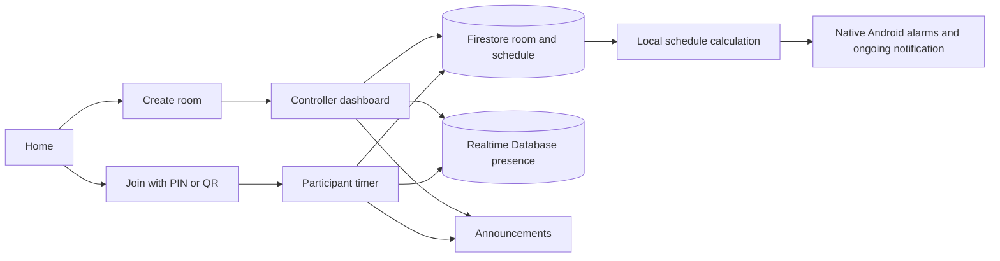

# Architecture and verification snapshot

This is the recruiter-facing technical summary for Timer Be Perfect. It explains
the system boundary and the evidence behind its most important claim without
publishing raw Graphify data or machine-specific build output.

## What the system proves

Be Perfect coordinates timed church activities across a controller device and
multiple participant devices. The controller publishes an authoritative room
schedule. Each device renders that schedule locally, schedules its own alarms,
and reports presence through Firebase.

The offline guarantee is deliberately limited:

- A device continues the last confirmed countdown, round transitions, local
  alarms, and ongoing timer notification during a temporary outage.
- A controller cannot safely publish new commands while offline.
- Participants cannot receive new announcements or schedule changes until they
  reconnect.
- The controller can identify offline participants from the Firebase presence
  heartbeat.

## System flow

## Responsibility boundaries

| Concern | Authority or mechanism | Why it matters |
| --- | --- | --- |
| Room membership and schedule | Firestore / trusted Functions or secured fallback | Shared state has one source of truth |
| Visible countdown | Local schedule engine | No per-second network writes |
| Offline continuation | Last confirmed schedule plus local calculation | Temporary outages do not erase an active event |
| Device presence | Realtime Database heartbeat | Controller sees stale/offline participants |
| Wake-up and announcements | FCM, best effort | Notifications are not the event clock |
| Round boundaries | Local exact alarms | Boundary behavior continues when the UI is closed |
| Ongoing timer | Android notification chronometer | The operating system renders the countdown |
| Roles | Room ownership and membership checks | Joining never grants controller authority |

## Source map

- `lib/core/timer/schedule_engine.dart` — phase derivation and countdown rules.
- `lib/app/routes.dart` — role routing, shared run listener, alarm scheduling,
  and room lifecycle.
- `lib/core/firebase/room_repository.dart` — Firebase operations and fallback
  behavior.
- `lib/core/firebase/presence_service.dart` — heartbeat and online state.
- `lib/core/notifications/notification_service.dart` — ongoing notification
  and boundary alarm integration.
- `functions/src/` — trusted room and command operations.
- `firestore.rules` — room isolation and role boundaries.
- `test/` and `integration_test/` — unit, widget, and smoke coverage.

## Verification matrix

| Claim | Evidence | Limitation | Status |
| --- | --- | --- | --- |
| Countdown continues from the last confirmed schedule during an outage | Physical multi-device rehearsal and local schedule tests | New remote commands cannot arrive offline | Verified for the tested scenario |
| Round alarms and ongoing notification continue | Physical Android notification/alarm checks and notification implementation | Android permissions, battery policy, and force-stop state affect delivery | Verified with platform caveats |
| Controller can see participant availability | Firebase Realtime Database heartbeat implementation and device testing | Presence is freshness data, not proof of user activity | Implemented and tested |
| Joining never grants controller authority | Firestore rules, room authorization logic, and multi-role tests | A deployment must use the intended rules and Functions/configuration | Implemented and tested |
| Release artifacts are reproducible | Obfuscated split-ABI build commands, symbols, checksums, and release records | The current repository has not been uploaded yet | Verified for recorded builds |

## Graphify refresh

Generated from the correct repository root on **2026-08-12** with Graphify
0.8.44 using the deterministic code update path:

- 958 nodes
- 1,338 edges
- 87 communities
- 94% extracted edges and 5% inferred edges in the generated report

Raw `graph.json`, `graph.html`, caches, and historical graph snapshots remain
local and are excluded from the public repository. The refresh updated the code
graph without an LLM API key; newly changed documents and screenshots were not
semantically re-extracted. This is therefore a current structural snapshot, not
a claim of a complete semantic corpus rebuild.
